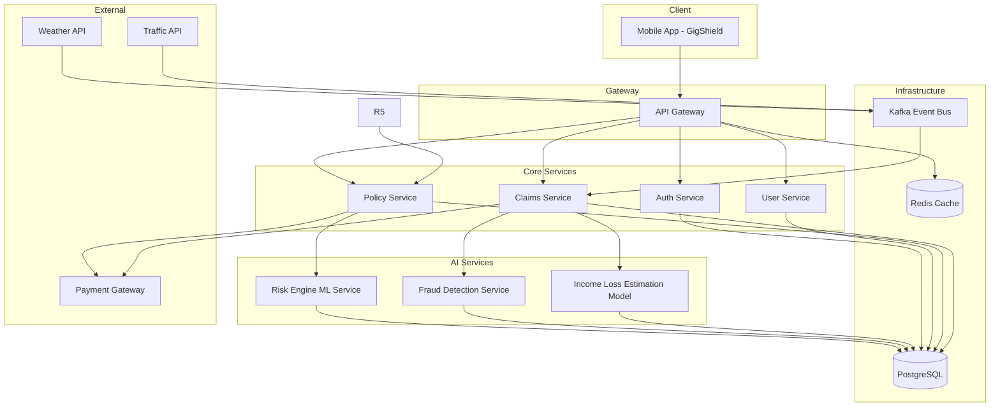
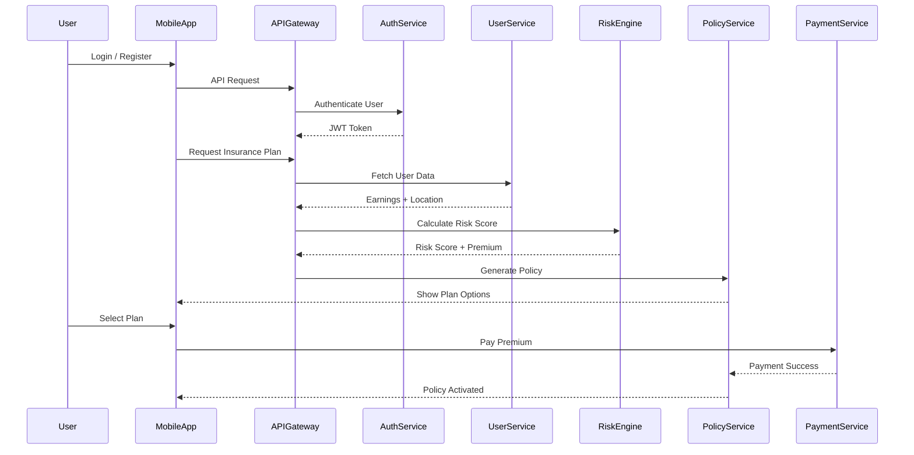
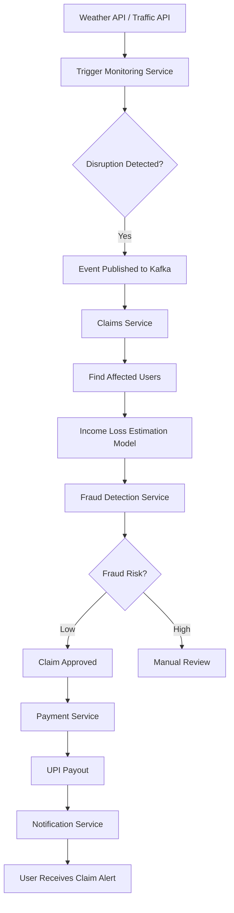
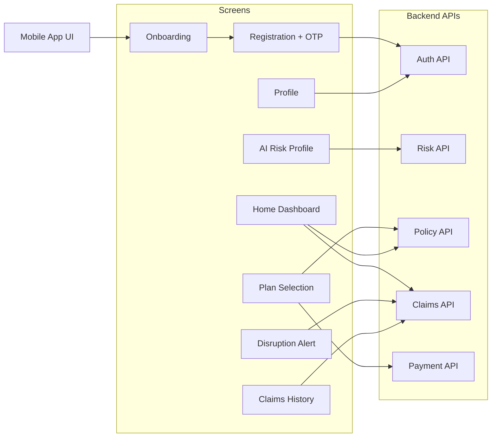

# DEV_TRAILS_HACKATHON

## ARCHITECTURE

### 1. High Level Architecture

### 2. Premium Purchase Flow (Risk Based)

### 3. Auto Claim Workflow

### 4. Frontend → Backend Interaction (GigShield App)

